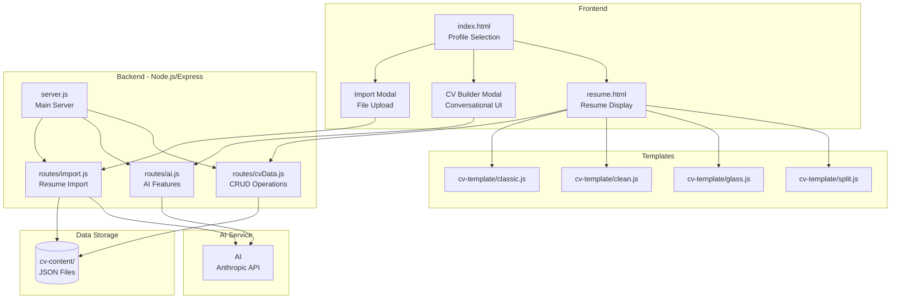
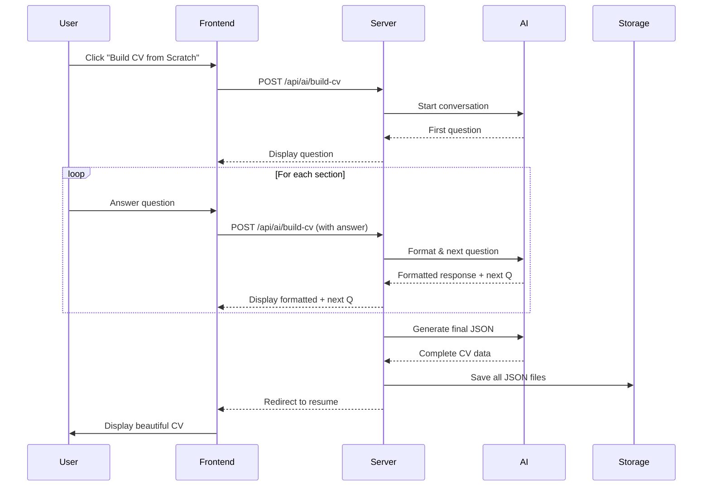

# 🚀 AI-Powered Dynamic Resume Builder

A modern, interactive resume builder with **AI-powered features** using AI. Create professional resumes through conversational chat, import existing resumes, or edit content in real-time with AI optimization.


---

## ✨ Features

### 🤖 **AI-Powered CV Builder**
- **Conversational Interface**: Chat with AI to build your resume step-by-step
- **Smart Formatting**: AI automatically reformats your input into professional bullet points
- **Progress Tracking**: Visual progress bar showing completion status
- **Example Inputs**: Helpful examples for each question

### 📄 **Resume Import**
- Upload PDF or text resumes
- AI extracts and structures all information automatically
- Instant profile creation

### 🎨 **4 Professional Templates**
1. **Split View** - Modern sidebar layout
2. **Glassmorphism** - Futuristic glass effects
3. **Modern Clean** - Minimalist design
4. **Classic Dark** - Professional dark theme

### ✏️ **Live Editing**
- Edit any section with inline buttons
- AI-powered content optimization
- Real-time preview
- Auto-save to backend

### 📊 **Multi-Profile Management**
- Create and manage multiple resumes
- Switch between profiles instantly
- Delete profiles with confirmation

---

## 🏗️ Architecture



---

## 📁 Project Structure

```
shubham-sharma/
├── server.js                    # Main server (35 lines)
├── routes/
│   ├── cvData.js               # CV data management
│   ├── ai.js                   # AI features (optimize, CV builder)
│   └── import.js               # Resume import
├── cv-template/
│   ├── split.js                # Split view template
│   ├── glass.js                # Glassmorphism template
│   ├── clean.js                # Modern clean template
│   └── classic.js              # Classic dark template
├── cv-content/
│   ├── users.json              # User profiles list
│   ├── {userId}/
│   │   ├── profile.json        # Personal info
│   │   ├── summary.json        # Professional summary
│   │   ├── journey.json        # Work experience
│   │   ├── skills.json         # Technical skills
│   │   ├── education.json      # Education & certifications
│   │   └── highlights.json     # Career highlights
├── index.html                  # Profile selection page
├── resume.html                 # Resume display page
└── package.json                # Dependencies
```

---

## 🚀 Quick Start

### Prerequisites
- Node.js >= 16.0.0
- Anthropic API Key (AI)

### Installation

1. **Clone the repository**
```bash
git clone <repository-url>
cd shubham-sharma
```

2. **Install dependencies**
```bash
npm install
```

3. **Configure environment**
```bash
cp .env.example .env
```

Edit `.env` and add your Anthropic API key:
```env
ANTHROPIC_API_KEY=your_api_key_here
MODEL_NAME=claude-sonnet-4-5-20250929
```

4. **Start the server**
```bash
npm start
```

5. **Open in browser**
```
http://localhost:3000/index.html
```

---

## 📖 Usage Guide

### Method 1: Build CV from Scratch (AI-Powered)

1. Click **"Build CV from Scratch"** button
2. Chat with AI - answer questions naturally
3. AI formats your responses professionally
4. Progress bar shows completion status
5. CV is automatically created and displayed

**Example Conversation:**
```
AI: What is your full name?
You: John Doe

AI: Great! What's your email address?
You: john.doe@example.com

AI: Tell me about your work experience...
You: I worked at Google for 3 years building recommendation 
     systems that improved engagement by 35%. Led a team of 
     5 engineers and reduced API latency from 200ms to 50ms.

AI: Great! I've formatted that as:
• Built recommendation system that improved user engagement by 35%
• Led team of 5 engineers to optimize backend performance
• Reduced API latency by 75% (200ms → 50ms)
```

### Method 2: Import Existing Resume

1. Click **"Import PDF / Text Resume"**
2. Upload your resume file
3. AI extracts and structures all information
4. Review and edit if needed
5. Choose your preferred template

### Method 3: View Existing Profiles

1. Browse profiles on home page
2. Click **"View Resume"** on any profile
3. Switch between 4 different templates
4. Edit content inline with AI assistance
5. Download as PDF

---

## 🎯 API Endpoints

### CV Data Management
```
POST   /api/save/:userId/:file    # Save CV data
POST   /api/save-users             # Update users list
DELETE /api/delete/:userId         # Delete profile
```

### AI Features
```
POST   /api/ai/optimize            # Optimize resume text
POST   /api/ai/build-cv            # Conversational CV builder
```

### Import
```
POST   /api/import                 # Upload & parse resume
```

---

## 🛠️ Tech Stack

### Frontend
- **HTML5** - Structure
- **CSS3** - Styling (Vanilla CSS, no frameworks)
- **JavaScript** - Dynamic interactions
- **Font Awesome** - Icons
- **Google Fonts** - Typography (Outfit, Space Grotesk)

### Backend
- **Node.js** - Runtime
- **Express** - Web framework
- **Anthropic SDK** - AI integration
- **Multer** - File uploads
- **pdf-parse** - PDF text extraction

### AI
- **Claude 4.5 Sonnet** - Content optimization & CV building

---

## 🎨 Template Features

### Split View
- Fixed sidebar with contact info
- Main content area with sections
- Clean, professional layout

### Glassmorphism
- Futuristic glass effects
- Dark theme with gradients
- Modern, eye-catching design

### Modern Clean
- Minimalist approach
- Excellent readability
- Professional and simple

### Classic Dark
- Traditional resume format
- Dark theme for reduced eye strain
- Timeless design

---

## 🔐 Security Features

- Path traversal prevention
- File type validation
- File size limits (5MB)
- Input sanitization
- Environment variable protection

---

## 📊 Data Flow



---

## 🤝 Contributing

Contributions are welcome! Please follow these steps:

1. Fork the repository
2. Create a feature branch (`git checkout -b feature/AmazingFeature`)
3. Commit your changes (`git commit -m 'Add AmazingFeature'`)
4. Push to the branch (`git push origin feature/AmazingFeature`)
5. Open a Pull Request

---

## 📝 License

This project is licensed under the MIT License.

---

## 🙏 Acknowledgments

- **Anthropic** for AI
- **Font Awesome** for icons
- **Google Fonts** for typography

---

## 📧 Contact

For questions or support, please open an issue on GitHub.

---

**Built with ❤️ using AI**